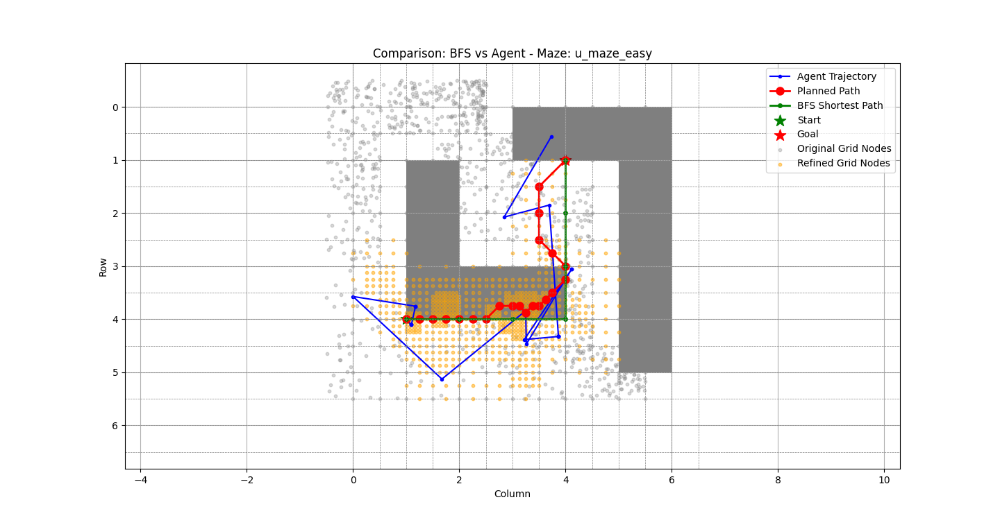
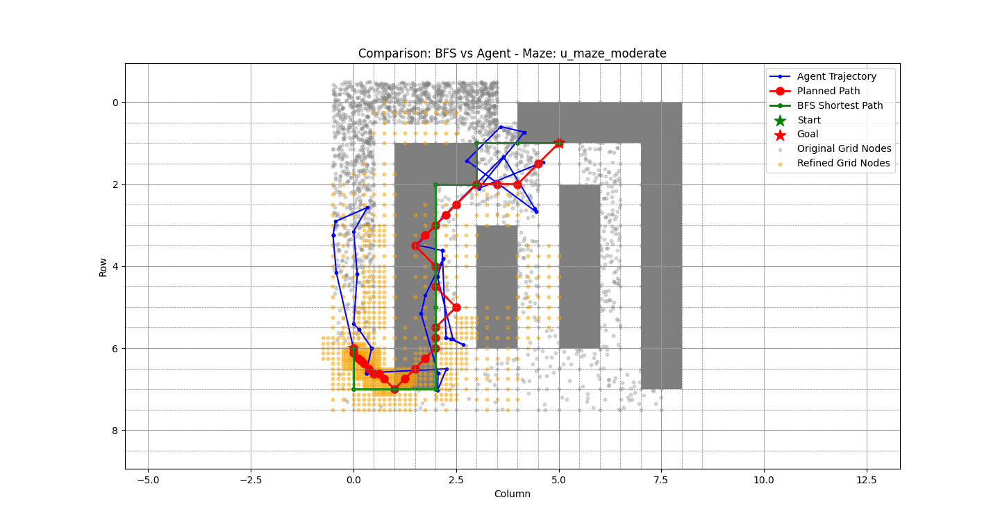
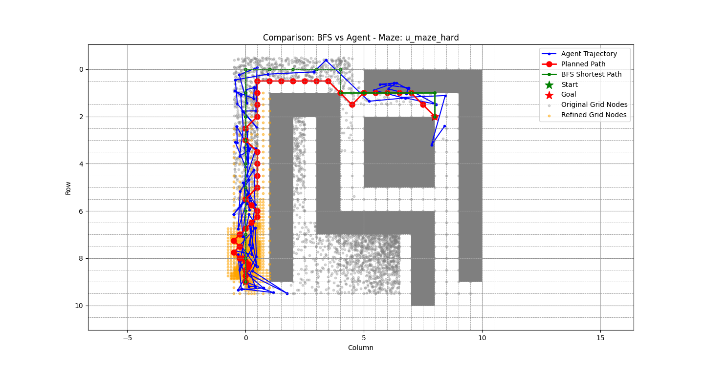

# 🧭 Breadth-First Exploration on Adaptive Grid (BFEAG)

This project is a simulation inspired by the NeurIPS 2023 paper  
**"Breadth-First Exploration on Adaptive Grid for Reinforcement Learning"**.

---

## 🎯 Objective

To simulate and visualize the behavior of:
- Breadth-First Search (BFS) in a grid-based maze
- Agent's actual trajectory under a learned or heuristic policy
- Comparison between planned paths vs. real movement

This helps illustrate exploration dynamics and grid refinement ideas proposed in the paper.

---

## 🗺️ Environment Setup

We generate U-shaped maze environments of different difficulty levels:
- `u_maze_easy`
- `u_maze_moderate`
- `u_maze_hard`

Each maze contains:
- Discrete grid structure
- Obstacles (gray blocks)
- Start & goal states

---

## 🔍 Key Elements in the Plots

- 🔵 Blue Line: **Agent's Actual Trajectory**
- 🔴 Red Line: **Planned Path**
- ✅ Green Line: **BFS Shortest Path**
- 🟢 Green Star: **Start Position**
- 🔴 Red Star: **Goal Position**
- ⚫ Gray Dots: **Original Grid Nodes**
- 🟡 Orange Dots: **Refined Grid Nodes**

---

## 📊 Visualizations

| Maze: Easy | Maze: Moderate | Maze: Hard |
|------------|----------------|------------|
|  |  |  |

---

## 🧪 What’s Implemented

- Maze generation and rendering
- BFS planning logic
- Agent trajectory simulation
- Visual comparison with BFS shortest path
- Overlay of original vs. refined grid nodes

---

## 📚 Reference

- **Paper**: [Breadth-First Exploration on Adaptive Grid for Reinforcement Learning (NeurIPS 2023)]([https://arxiv.org/abs/2306.11544](https://openreview.net/forum?id=59MYoLghyk))
- This is a simplified conceptual visualization, not a full reproduction of the paper

---

## 🚀 Future Work

- Extend to Gym environments (e.g., `Ant-v5`)
- Integrate HER + adaptive grid reward shaping
- Learn policies with DDPG/SAC over refined grid
